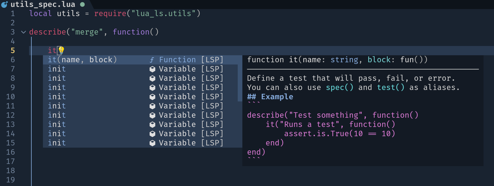
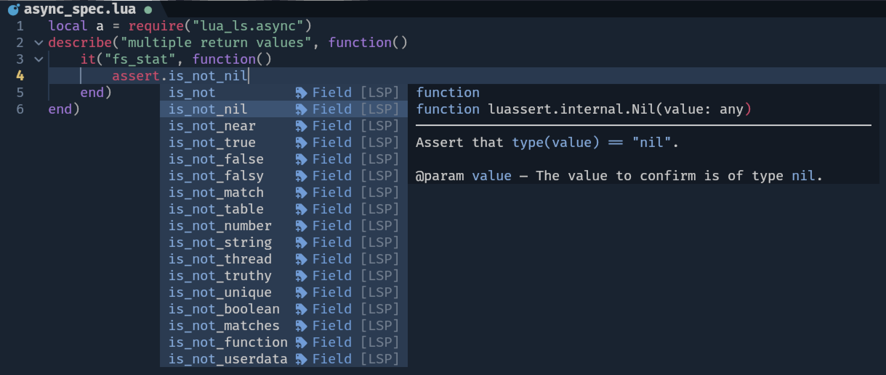
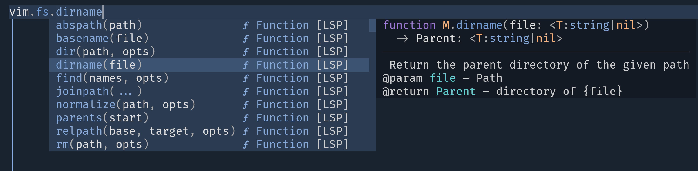
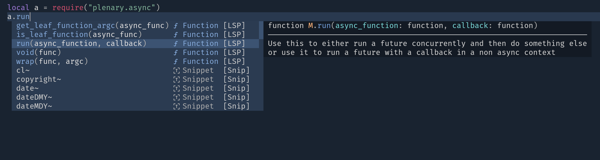

# Introduction


## Features

- [Addon management capability](https://luals.github.io/wiki/addons/#addon-manager) for [lua language server](https://github.com/luals/lua-language-server)
- Support neovim/plugins complete


<table>
    <tr>
        <th>busted</th>
        <th>luassert(busted assert)</th>
    </tr>
    <tr>
        <th style="text-align:center">
            
        </th>
        <th>
            
        </th>
    </tr>
    <tr>
        <th>nvim stdlib</th>
        <th>nvim plugin</th>
    </tr>
    <tr>
        <th style="text-align:center">
            
        </th>
        <th style="text-align:center">
            
        </th>
    </tr>
</table>


# Installation

- With 💤lazy.nvim:

```lua
{
    "AbaoFromCUG/lua_ls.nvim",
    event = "VeryLazy",
    opts= {
        enable = true,
        -- install default
        addons = {
            -- addon published on https://github.com/LuaLS/LLS-Addons
            "luassert",
            -- neovim/plugins in rtp
            "nvim",
            "nvim-lspconfig",
        }
    }
}
```

Supported addons

- [x] Neovim plugins
- [x] Install from [LLS-Addons](https://github.com/LuaLS/LLS-Addons) automatically
- [x] Local addon
- [x] Remote addon

# Integration


## [Neoconf.nvim](https://github.com/folke/neoconf.nvim)

`lua_ls.nvim` support neoconf, like it's a native settings supported by lua language server

`.neoconf.json`

```json
{
  "lua_ls": {
    "addons": [
      "nvim-full",
      "nvim",
      "nvim-lspconfig",
      "luassert",
      "busted"
    ]
  }
}
```
